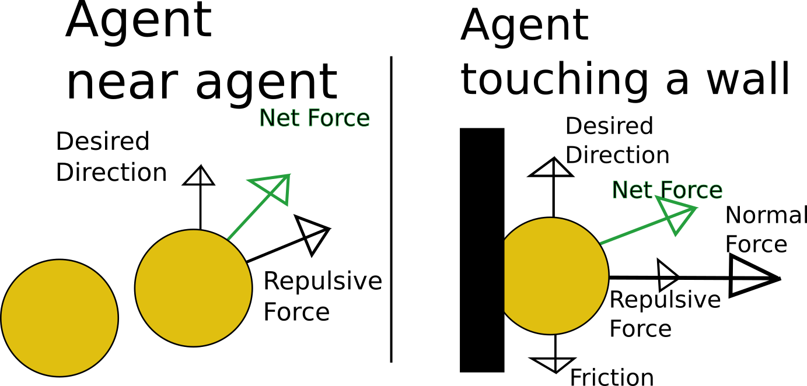
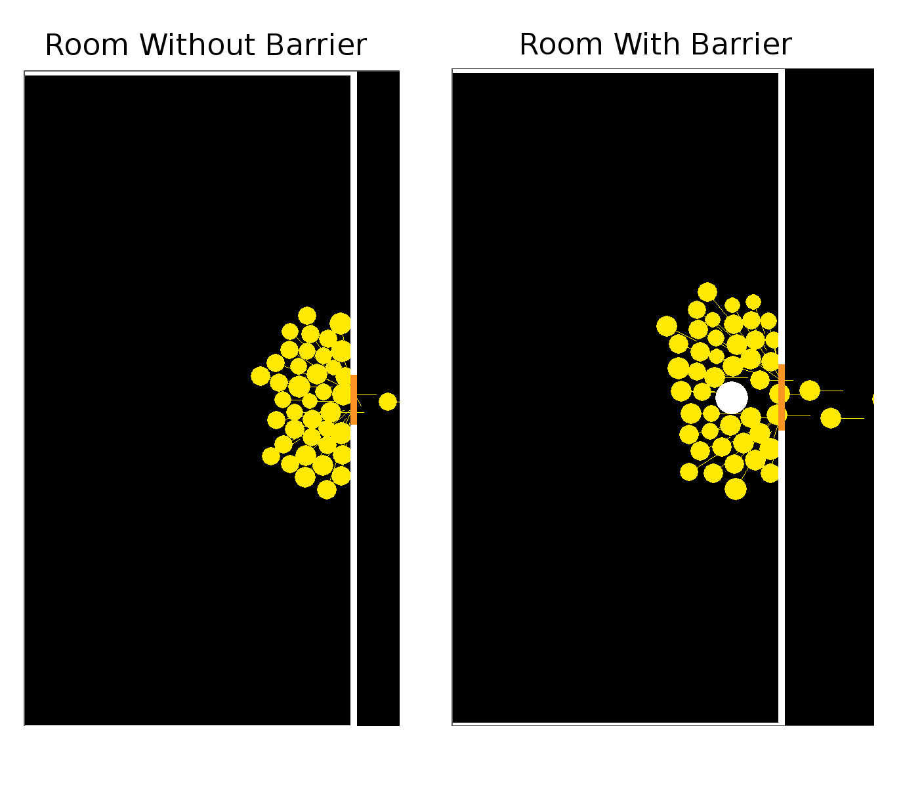
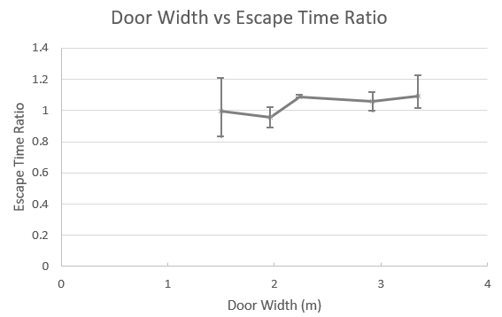
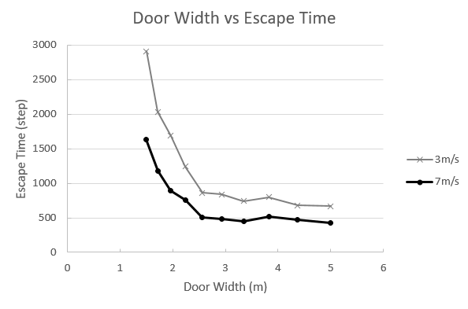

# A Multiple-Agent Based Model of Evacuation

Adam Novotny, Changjun Lim

## Abstract

There have been various approaches to model human walking dynamics, specifically in evacuation scenarios. Researchers have used tools ranging from agent-based models [1] and physical simulations, [1, 2] to cellular automaton models [3] and even game theory [4]. These models are useful for exploring the emergent behavior of pedestrians. Experiments modeling evacuations can help identify which features are the most important for reducing evacuation time.

Yanagisawa et al. [5] ran an experiment with people to analyze human behavior during an evacuation. Counter-intuitively, they found that a small barrier near the exit reduces evacuation time. They suggest that the biggest bottleneck in an unorganized evacuation is resolving who goes through the doorway (described as a 'conflict'). By reducing the available area in front of the door, the barrier reduces conflicts and speeds up evacuation time.

Then, they modeled people as agents on a grid world to extrapolate findings about barrier placement. We adopt the agent-based physics model proposed by Helbing, Farkas, and Vicsek [1] to explore evacuation in a continuous world. This model describes pedestrian behaviors, including panic and jamming, with a generalized force model. We want to find whether a barrier actually reduces evacuation time, and what other parameters (door width, number of agents, etc.) are the most important for fast evacuations.

## Reproduction

We create an agent-based physical simulation of people attempting to escape a room through a narrow doorway. We based our model on the generalized force model of Helbing et al. [1]. In their model, agents want to move at the desired velocity while keeping a distance from other agents and walls. This is modeled as a self-driving force and a 'psychological force' which acts on each agent, in addition to the physical forces (friction and normal force from walls and other agents). Figure 1 shows a visualization of all of the forces that we model.
A self-driving force is proportional to the difference between the desired velocity and current velocity. The magnitude of the psychological force is an exponential function of the distance between surfaces of an agent and walls or other agents. So, even if an agent is not colliding with other objects, there is a psychological force repelling it from them. The magnitude of friction and normal force is proportional to the overlapped length between an agent and walls or other agents. There is no friction nor normal force when an agent is not in contact with other objects. We choose the coefficients of forces from the original paper [1].

We had to tune some constants slightly to get a more realistic looking simulation of people.

> Figure 1: A visualization of the forces acting on an agent when near another agent, and when in contact with a wall

> Figure 2: A visualization of the model with and without a barrier. The vectors from each agent are each agent's desired direction

Figure 2 is a visualization of the simulated room and doorway. Agents crowd around the exit, trying to push their way out. On the right, we show a room with a barrier. The entrance has visibly less pressure on it, as the barrier blocks agents from approaching it straight on.

> A video of the agents evacuating. Notice minor resonance between neighbors

In our model, we noticed some spring-like behavior and resonance between agents. The crowd would run up to the wall and compress against it, then expand backward before settling into a densely packed configuration. Further tuning the agent's psychological force constants would decrease this springiness, but overall the physical model is realistic.

## Different Barriers

We then run the simulation with a parameter sweep to see how the parameters affect evacuation time. We plot the time it takes for all agents to exit the room. We assume the case where 49 people, having a diameter uniformly distributed in the interval [0.5m, 0.7m], are leaving through a doorway. All results are the average of two simulations. This is probably not enough averaging, but it is better than a single run and running physics on multiple bodies is extremely slow in python.

> Figure 3: The ratio of time between the same room with and without a barrier

> Figure 4: The door width vs escape time

Figure 3 shows the ratio of evacuation times between a room with a barrier and without. A value below 1 means the barrier sped up evacuation time. We can see that the barrier has little benefit, and for wider doors can slow down evacuation. The bars show the minimum and maximum ratios for barrier sizes between 0.5 and 3 meters.

We find that when the door is small (a strong bottleneck), a barrier in front of the door makes the evacuation quicker. The explanation that others have suggested is that, by blocking part of the pressure on the doorway, conflicts near the door are reduced.

Another explanation is that the barrier parallelizes the bottlenecks. If the barrier creates two gaps approximately the size of a doorway, this is similar to doubling the number of bottlenecks. Now, twice as many people should be able to go through. Once an agent gets through the gap, it can easily walk out the door as there is no crowd in the doorway.

Generally though, the barrier had little effect. We have found a few specific configurations of the barrier that result in much faster evacuations. This indicates that either our model is not completely accurate and we are overfitting the solution (quite possible) or that the effect is very sensitive to placement and size of the barrier. We did not have the computational power to study these effects on a granular level. Further research should be done to analyze the relationship between precise barrier parameters and the evacuation time.

The most important parameter is the width of the door. In Figure 4 we can see that the slope is very steep downwards until it saturates at 2.5 meters wide (for 49 people with an average diameter of 0.6m). This means it is very easy to optimize a door for evacuation, that is, by making it wider.

## Interpretation
We have found that a barrier has the ability to speed up evacuation through a narrow doorway. The effect is sensitive to doorway size, and further research should be done to discover the principals for designing a doorway barrier. We have shown that the barrier is almost unnecessary though, because widening the door has a much bigger effect on evacuation time.

So please do not start putting barriers in front of fire exits; human tendencies like assessing the worthiness of an exit were not modeled, and more empirical tests should be run before rewriting the fire code.

## Review

Generally, this project went all right. In the future, I would not write physics models in python, as running a single simulation with 100 agents took multiple minutes to complete. This was still okay to find data, but if it was 10-100x faster, we might have been able to find more meaningful conclusions.

## Annotated Bibliography

[1] [**Simulating dynamical features of escape panic**](https://www.nature.com/nature/journal/v407/n6803/abs/407487a0.html)

Helbing, D., Farkas, I., & Vicsek, T. (2000). Simulating dynamical features of escape panic. Nature, 407(6803), 487-490.

Helbing, Farkas and Vicsek propose the model describing pedestrian behaviors like panic and jamming in the evacuation process. The crowd dynamics of pedestrians are based on a generalized force model. They simulate the situation in which pedestrians escapes through a narrow exit and a wider area. They observe the evacuation process with respect to parameters such as pedestrians' velocity, panic, and angle.

[2] [**Social force model for pedestrian dynamics**](https://arxiv.org/pdf/cond-mat/9805244)

Helbing, D., & Molnar, P. (1995). Social force model for pedestrian dynamics. Physical review E, 51(5), 4282.

Dirk Helbing and Péter Molnár model pedestrian traffic using a physics model with social forces. Each pedestrian has a goal, repels from walls and other individuals, and has 'distractions' that attract it (friends, posters, etc). Using this model, they show the emergent phenomena describe real-world pedestrian movements, like lane formation and crowd-door dynamics.

[3] [**Cellular automaton model for evacuation process with obstacles**](http://www.sciencedirect.com/science/article/pii/S0378437107003676)

_Varas, A., Cornejo, M. D., Mainemer, D., Toledo, B., Rogan, J., Munoz, V., & Valdivia, J. A. (2007). Cellular automaton model for evacuation process with obstacles. Physica A: Statistical Mechanics and its Applications, 382(2), 631-642._

Varas, Cornejo, Mainemer, Toldeo, Rogan, Munoz and Valdivia simulate the behavior of pedestrian evacuating a room with a fixed obstacles so that they can find the effect of obstacles in an evacuation. They use the 2D cellular automation model in which pedestrian movement is determined by a static floor field, interaction with others and 'panic'. They experiment the evacuation process by changing the width and position of exit doors. They find that increasing exit width beyond the critical value does not reduce evacuation time and corners of the room are the worst position for an evacuation.

[4] [**A game theory based exit selection model for evacuation**](http://www.sciencedirect.com/science/article/pii/S037971120600021X)

Lo, S. M., Huang, H. C., Wang, P., & Yuen, K. K. (2006). A game theory based exit selection model for evacuation. Fire Safety Journal, 41(5), 364-369.

Lo, Huang, Wang and Yuen integrate non-cooperative game theory with evacuation model to study the behavioral reaction of the evacuees. Their non-cooperative game theory model has been established to test how the evacuation pattern will be affected by a rational interaction between evacuees. In their model, evacuees perceive the actions of others and the environmental condition and decide their escape route. They found the mixed-strategy _Nash Equilibrium_ for the game which describes the congestion states of exits. They suggest examining the effect of familiarity and 'grouping' effect on further studies.

[5] [Introduction of frictional and turning function for pedestrian outflow with an obstacle.](https://arxiv.org/pdf/0906.0224)

Yanagisawa, D., Kimura, A., Tomoeda, A., Nishi, R., Suma, Y., Ohtsuka, K., & Nishinari, K. (2009). Introduction of frictional and turning function for pedestrian outflow with an obstacle. Physical Review E, 80(3), 036110.

Yanagisawa et al. explore how a barrier affects evacuation time in a simulation and empirical experiment.
