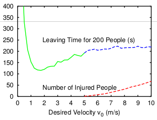

# A Multiple-Agent Based Model of Evacuation

Adam Novotny, Changjun Lim

## Abstract

There have been various approaches to model human walking dynamics, specifically in evacuation scenarios. Researcher have used tools ranging from agent-based models [1] and physical simulations, [1, 2] to cellular automaton models [3] and even game theory [4]. These models are useful for exploring the emergent behavior of pedestrians. Experiments modeling evacuations can help identify which features are the most important for reducing evacuation time.

Yanagisawa et al. [5] ran an experiment with real people to analyze human behavior during an evacuation. They found that a small barrier counter-intuitively reduces evacuation time. They suggest that the biggest bottleneck in an evacuation is resolving who goes through the doorway (described as 'conflicts'). By reducing the area in front of the door, the barrier reduces conflicts and speeds up evacuation time.

Then, they modeled people as agents on a grid world to extrapolate findings about barrier placement. We adopt the agent-based physics model proposed by Helbing, Farkas, and Vicsek [1] to attempt to recreate the findings. This model describes pedestrian behaviors, including panic and jamming, with a generalized force model.

We also show that the door width affects evacuation time {like this} and that the barrier should be {this big} for fastest evacuations.


## Reproduction
We create an agent-based physical simulation of people attempting to escape a room through a narrow doorway. We based our model on the code from Helbing et al. [1]. In their model, agents are simulated as circular masses with forces acting on them. Agents have a desired direction, and exert a force towards it. Agents also want to keep away from walls and other agents. This is modeled as a 'psychological force' which acts on each agent, in addition to the physical forces (friction and normal force from walls and other agents). Figure {} shows a visualization of all of the forces that we model.


> A visualization of the forces acting on an agent when near a wall, and when in contact with a wall


> A visualization of the model with and without a barrier. The lines are agents' desired direction

We add a circular barrier in front of the doorway with r={} and analyze how evacuation time is affected.

We validate our model by comparing our plot for escape time vs desired speed to a plot from Helbing et al. [1].


> Note: our plot is not visible because it doesn't exist

## Different Barriers

We then run the simulation multiple times to see how different parameters affect evacuation time.

> Sample plot output (note: we are not modeling injury)

For n barrier sizes and positions (including no barrier):
```
{plot: escape time vs number of agents}
{plot: escape time vs desired velocity}
{plot: escape time vs door size}
{plot: escape time vs barrier size (for a few door sizes)}
{plot: escape time vs barrier placement (for a few sizes)}
```

We can see in the above plots that escape time {increases | decreases} when {door size | barrier size} changes.

The optimal escape time for n agents is a barrier at {size and position}.

## Adding Panic
Crowd dynamics also include panic. Panicked people want to go faster, and therefore push more against agents in their way.

We {will} model panic when agents become impatient (eg. in a burning building).


## Interpretation
We found that <>.

But please do not put barriers in front of fire exits; human tendencies like assessing the worthiness of an exit were not modeled, and empirical tests should be run before rewriting the fire code.


## Annotated Bibliography

[1] [**Simulating dynamical features of escape panic**](https://www.nature.com/nature/journal/v407/n6803/abs/407487a0.html)

Helbing, D., Farkas, I., & Vicsek, T. (2000). Simulating dynamical features of escape panic. Nature, 407(6803), 487-490.

Helbing, Farkas and Vicsek propose the model describing pedestrian behaviors like panic and jamming in the evacuation process. The crowd dynamics of pedestrians are based on a generalized force model. They simulate the situation in which pedestrians escapes through a narrow exit and a wider area. They observe the evacuation process with respect to parameters such as pedestrians' velocity, panic, and angle.

[2] [**Social force model for pedestrian dynamics**](https://arxiv.org/pdf/cond-mat/9805244)

Helbing, D., & Molnar, P. (1995). Social force model for pedestrian dynamics. Physical review E, 51(5), 4282.

Dirk Helbing and Péter Molnár model pedestrian traffic using a physics model with social forces. Each pedestrian has a goal, repels from walls and other individuals, and has 'distractions' that attract it (friends, posters, etc). Using this model, they show the emergent phenomena describe real-world pedestrian movements, like lane formation and crowd-door dynamics.

[3] [**Cellular automaton model for evacuation process with obstacles**](http://www.sciencedirect.com/science/article/pii/S0378437107003676)

_Varas, A., Cornejo, M. D., Mainemer, D., Toledo, B., Rogan, J., Munoz, V., & Valdivia, J. A. (2007). Cellular automaton model for evacuation process with obstacles. Physica A: Statistical Mechanics and its Applications, 382(2), 631-642._

Varas, Cornejo, Mainemer, Toldeo, Rogan, Munoz and Valdivia simulate the behavior of pedestrian evacuating a room with a fixed obstacles so that they can find the effect of obstacles in an evacuation. They use the 2D cellular automation model in which pedestrian movement is determined by a static floor field, interaction with others and 'panic'. They experiment the evacuation process by changing the width and position of exit doors. They find that increasing exit width beyond the critical value does not reduce evacuation time and corners of the room are the worst position for an evacuation.

[4] [**A game theory based exit selection model for evacuation**](http://www.sciencedirect.com/science/article/pii/S037971120600021X)

Lo, S. M., Huang, H. C., Wang, P., & Yuen, K. K. (2006). A game theory based exit selection model for evacuation. Fire Safety Journal, 41(5), 364-369.

Lo, Huang, Wang and Yuen integrate non-cooperative game theory with evacuation model to study the behavioral reaction of the evacuees. Their non-cooperative game theory model has been established to test how how the evacuation pattern will be affected by rational interaction between evacuees. In their model, evacuees perceive the actions of others and the environmental condition and decide their escape route. They fuind the mixed-strategry _Nash Equilibrium_ for the game which describes the congestion states of exits. They suggest to examine the effect of familiarity and 'grouping' effect on further studies.

[5] [Introduction of frictional and turning function for pedestrian outflow with an obstacle.](https://arxiv.org/pdf/0906.0224)

Yanagisawa, D., Kimura, A., Tomoeda, A., Nishi, R., Suma, Y., Ohtsuka, K., & Nishinari, K. (2009). Introduction of frictional and turning function for pedestrian outflow with an obstacle. Physical Review E, 80(3), 036110.

Yanagisawa et al. explore how a barrier affects evacuation time in a simulation and emperical experiment.
