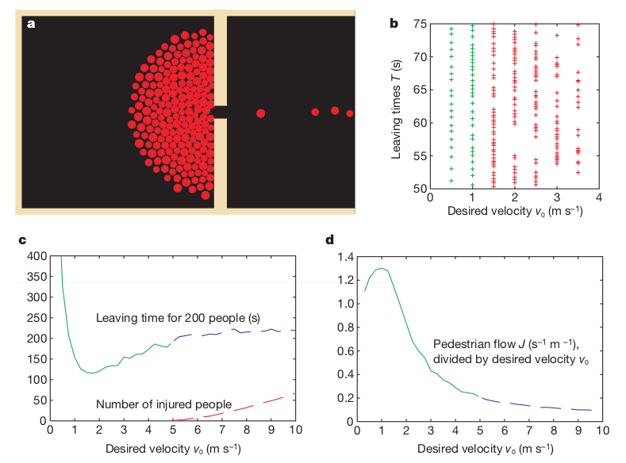

# A Multiple-Agent Based Model of Panicked Evacuation

Adam Novotny, Changjun Lim

## Abstract

There have been various approaches to describe the evacuation process of pedestrians, from an agent-based model [1] and a physical model [1, 2] to a cellular automaton model [3] and a game theory [4]. We will recreate the agent-based model proposed by Helbing, Farkas and Vicsek [1], which describes pedestrian behaviors, including panic and jamming, with a generalized force model. We will replicate the model for the situation that there is a single exit with a large crowd and visualize it. We then try to extend the model by inserting some barriers in front of a door and observe the changes in the evacuation time.

## Experiment Direction
The original research paper ran multiple experiments that we would like to replicate.
First, a single exit with a large crowd. This will let us validate that our model matches the original paper.

We want to extend our software to allow arbitrary map input (from vector graphics), so that we can experiment with different environments, including a widened corridor, multiple doors, etc. We want to try to replicate the findings of a different paper, in which placing a column in front of the exit decreased evacuation times.

The original paper implemented herding behavior and low visibility, but these are probably out of scope.

Our biggest technical risk is 1. making a usable physics simulation, 2. making agents have goals. After discussing the problems with peers and reading on the Internet, we concluded that making a physics simulation is feasible and that the agents can have simple goals while still creating emergent phenomena.

The original paper has very effective data visualization that we want to replicate and learn from.

Possible output graphs.

http://angel.elte.hu/panic/

http://angel.elte.hu/panic/pdf/panicLetter.pdf

### Annotated Bibliography

[1] [**Simulating dynamical features of escape panic**](https://www.nature.com/nature/journal/v407/n6803/abs/407487a0.html)

Helbing, D., Farkas, I., & Vicsek, T. (2000). Simulating dynamical features of escape panic. Nature, 407(6803), 487-490.

Helbing, Farkas and Vicsek propose the model describing pedestrian behaviors like panic and jamming in the evacuation process. The crowd dynamics of pedestrians are based on a generalized force model. They simulate the situation in which pedestrians escapes through a narrow exit and a wider area. They observe the evacuation process with respect to paramters such as pedestrians' velocity, panic and angle.

[2] [**Social force model for pedestrian dynamics**](https://arxiv.org/pdf/cond-mat/9805244)

Helbing, D., & Molnar, P. (1995). Social force model for pedestrian dynamics. Physical review E, 51(5), 4282.

Dirk Helbing and Péter Molnár model pedestrian traffic using a physics model with social forces. Each pedestrian has a goal, repels from walls and other individuals, and has 'distractions' that attract it (friends, posters, etc). Using this model, they show the emergent phenomena describe real-world pedestrian movements, like lane formation and crowd-door dynamics.

[3] [**Cellular automaton model for evacuation process with obstacles**](http://www.sciencedirect.com/science/article/pii/S0378437107003676)

_Varas, A., Cornejo, M. D., Mainemer, D., Toledo, B., Rogan, J., Munoz, V., & Valdivia, J. A. (2007). Cellular automaton model for evacuation process with obstacles. Physica A: Statistical Mechanics and its Applications, 382(2), 631-642._

Varas, Cornejo, Mainemer, Toldeo, Rogan, Munoz and Valdivia simulate the behavior of pedestrian evacuating a room with a fixed obstacles so that they can find the effect of obstacles in an evacuation. They use the 2D cellular automation model in which pedestrian movement is determined by a static floor field, interaction with others and 'panic'. They experiment the evacuation process by changing the width and position of exit doors. They find that increasing exit width beyond the critical value does not reduce evacuation time and corners of the room are the worst position for an evacuation.

[4] [**A game theory based exit selection model for evacuation**](http://www.sciencedirect.com/science/article/pii/S037971120600021X)

Lo, S. M., Huang, H. C., Wang, P., & Yuen, K. K. (2006). A game theory based exit selection model for evacuation. Fire Safety Journal, 41(5), 364-369.

Lo, Huang, Wang and Yuen integrate non-cooperative game theory with evacuation model to study the behavioral reation of the evacuees. Their non-cooperative game theory model has been established to test how how the evacuation pattern will be affected by rational interaction between evacuees. In their model, evacuees perceive the actions of others and the environmental condition and decide their escape route. They fuind the mixed-strategry _Nash Equilibrium_ for the game which describes the congestion states of exits. They suggest to examine the effect of familiarity and 'grouping' effect on further studies.
